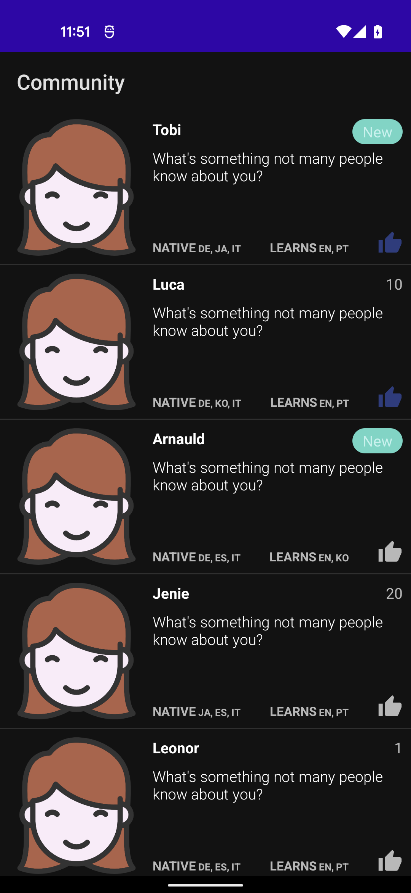
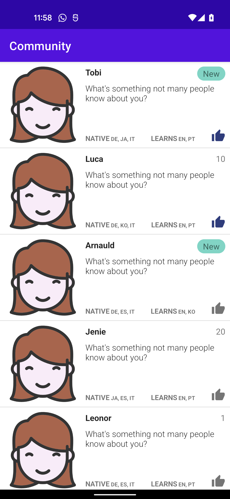

# Community App

### Screenshots
 

## Prerequisites
- Android min sdk 21 (Android 5.0)
- Java 11 (to run tests from command line)

## Getting Started
Clone the repo with `git clone git@github.com:TobiAlbert/Community.git`

## Libraries/Technologies Used
- Hilt
- Coroutines
- Retrofit
- Coil (for Image loading)
- Room
- Paging Library
- Chucker
- Espresso
- Truth (by Google)
